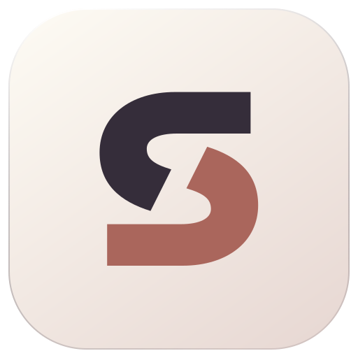

<p align="center">
  
</p>

<h1 align="center">SottoDuo</h1>

<p align="center">
  <strong>Dictation for macOS and Linux.</strong><br>
  Local Whisper or Soniox streaming, with shared microphones and history.
</p>

<p align="center">
  <a href="https://github.com/kristofferR/SottoDuo/actions/workflows/server.yml"></a>
  <a href="LICENSE"></a>
</p>

<p align="center">
  <a href="#build-from-source">Build from source</a> ·
  <a href="#changes-from-upstream-sotto">Changes from upstream Sotto</a> ·
  <a href="#documentation">Documentation</a>
</p>

---

SottoDuo is an MIT-licensed fork of [Sotto](https://github.com/davis7dotsh/sotto)
with a Linux desktop client, Soniox streaming, and shared microphone support.
Local recognition and cleanup run on hardware you control, with no required
service account, subscription, or word quota. Cloud recognition is optional;
recordings and history are stored on your own server.

The native Swift and Qt Quick clients connect to a self-hosted macOS or Linux
server. Run everything on one machine, or offload inference from your laptop to
a separate server. Dictionaries, cleanup settings, and history are shared across
clients, so vocabulary and cleanup changes only need to be made once.

## Changes from upstream Sotto

The Mac app, Whisper/Qwen pipeline, Mac/Linux server, dictionaries, shared
history, and Wispr Flow import come from upstream. SottoDuo adds:

| Addition | What it does |
| --- | --- |
| **Linux desktop app** | Qt Quick client for Omarchy/Hyprland and experimental KDE Plasma Wayland, with history, microphone priorities, shared preferences, and a recording overlay. Light, dark, and Omarchy themes. |
| **Soniox streaming** | Live transcript previews with optional local Whisper fallback if cloud recognition fails. Choose cloud, local, or automatic mode without switching apps. |
| **Remote microphones** | Share a microphone connected to a Linux server between desktops without moving the receiver. Mac microphone priorities can mix local and remote inputs. |
| **DJI button routing** | Start and stop dictation from the transmitter's linking button, with the receiver connected to Mac or Linux. Select which computer receives the text. |

Linux insertion depends on application accessibility support; terminals use explicit
copy and paste. Omarchy/Hyprland is the verified Linux desktop; Plasma integration
still needs real-device validation, and its overlay placement is not guaranteed.
Wispr Flow history import runs on the Mac, while either desktop can browse
imported records.

## Recognition and privacy

| Mode | How speech is recognized |
| --- | --- |
| **Automatic** | Uses Soniox when a server API key is configured, otherwise Whisper. A cloud failure falls back to Whisper using the complete recording. Requires local Whisper to be ready. |
| **Cloud only** | Uses Soniox. Can accept recordings without local speech models; cloud failures are reported without local fallback. |
| **Local only** | Uses Whisper on your server. No audio is sent to Soniox. |

Choose the mode under **Server preferences**. Soniox requires your own API key;
configure it on the server using `SONIOX_API_KEY` or `--soniox-key-file`.
Cloud recognition sends normalized speech audio and vocabulary hints to Soniox.
Optional Qwen proofreading runs on your own server in every mode, so using cloud
recognition does not require cloud cleanup too.

Cleanup is configurable: edit the full prompt, set exact phrase replacements,
or disable Qwen while keeping dictionary corrections. Validation checks can
reject rewrites that alter quantities, negations, or too much of the original
wording. History exposes the original transcript, cleanup outcome, and model
details so you can investigate errors rather than seeing only the final text.

History and retained recordings live in the server's data directory. Original
microphone audio is kept by default; **Keep original microphone audio** controls
its retention for future takes. Back up that directory to preserve your history.
The desktop apps always need a reachable server, including in Local only mode.

See [Soniox setup and fallback behavior](docs/soniox-streaming.md) and
[server storage](docs/architecture.md#storage).

## Build from source

| Component | Requirements |
| --- | --- |
| **Mac app and local server** | Apple Silicon, macOS 14+, Xcode 26+ with the Metal compiler, Swift 6.2+, Bun 1.4.2, CMake, and Git. |
| **Linux desktop** | Omarchy/Hyprland or experimental KDE Plasma Wayland, the Linux client dependencies, Qt 6.8+, and LayerShellQt 6.6+. Requires a server with PipeWire capture enabled. |
| **Separate server** | Apple Silicon macOS, or Linux x86_64/ARM64 with CPU or optional NVIDIA CUDA inference. Linux container builds are also available. |

### On one Mac

```sh
git clone --recurse-submodules https://github.com/kristofferR/SottoDuo.git
cd SottoDuo
```

[Download the Whisper and Qwen models](Server/README.md#models) into `.local/models`,
then build and start:

```sh
export SOTTODUO_SPEECH_MODEL="$PWD/.local/models/ggml-large-v3-turbo.bin"
export SOTTODUO_TEXT_MODEL="$PWD/.local/models/Qwen3-4B-Instruct-2507-MLX-4bit"
./scripts/run-dev.sh
```

This starts the server at **http://localhost:8391** and opens **SottoDuo Dev**,
which has separate settings from the regular app.

Grant **Microphone** and **Accessibility** permissions. The default hold-to-dictate
key is <kbd>Right Option</kbd>, configurable under **This Mac**. Inputs are under
**Microphone**; dictionaries and cleanup are under **Server preferences**.
Recordings are limited to three minutes. For Fn/Globe shortcuts, set macOS
**Keyboard → Press Globe key to → Do Nothing** if its action conflicts.

For the regular app, run `./scripts/build-app.sh` and move `build/SottoDuo.app`
to Applications. It still needs the independently running server.

### On Linux

Start with the [Linux desktop guide](LinuxClient/gui/README.md) for dependencies
and installation, and enable [PipeWire capture](docs/pipewire-capture.md) on the
server. From a cloned repository with those dependencies installed:

```sh
bun install --frozen-lockfile
bash scripts/build-linux-client.sh
bash scripts/build-linux-gui.sh
build/linux-gui/sottoduo-gui
```

Under **This computer**, set up **Background dictation**, enter your server
details under **Connection**, and configure **Shortcuts**. Choose your inputs
under **Microphone**. The server's capture provider handles Linux recording,
including when the client and server run on the same computer.

### With a separate server

Follow the [server guide](Server/README.md) to build, install models, and run on
macOS, Linux, or in a container. On a client Mac, build only the app with
`./scripts/build-app.sh`; it needs no inference models locally.

Enter the server URL and token under **This Mac** or Linux's
**This computer → Connection**. Use HTTPS for remote hosts, or HTTP with the
server's literal Tailscale IP on your connected tailnet. Ordinary LAN addresses
require HTTPS.

## DJI microphone button

Supported USB receivers include DJI Mic Mini, Mini 2, and Mini 2S using the
`2CA3:4011` consumer-control interface. Connect the receiver over USB, then tap
the transmitter's linking button once to record and again to finish.
Bluetooth-only connections do not provide these button events.

- **Receiver on your Mac:** Enable **This Mac → DJI mic button → Use DJI mic
  button**, allow Input Monitoring, and select the receiver under **Microphone**.
- **Receiver on the Linux server:** Configure the capture and button helpers,
  enable reception on each client, and select the destination computer. A
  successful keyboard dictation can also select that computer for the next
  button take.

The destination stays fixed throughout a recording. Server-button selection
clears when the selected client locks, sleeps, or disconnects. Microphone
priorities apply to new recordings; SottoDuo does not switch inputs mid-sentence
or automatically hand off between USB and Bluetooth.

See [DJI button routing and setup](docs/dji-button-routing.md) and
[remote microphone selection on Mac](docs/mac-remote-capture.md).
USB button support builds on the findings in
[dji-mic-wispr-flow](https://github.com/caezium/dji-mic-wispr-flow).

## Development

```sh
./scripts/run-dev.sh start --skip-build   # Start existing Mac development builds
./scripts/run-dev.sh status
./scripts/run-dev.sh stop
./scripts/run-dev.sh restart             # Rebuild and restart
bun run check
bun run test
swift test                              # Swift client and shared code
```

Keep the model-path exports set for the Mac dev runner. It stores server data
in `.local/server`, client preferences in `.local/client`, and logs in
`.local/server.log`. Quitting the app leaves the server running. After rebuilding
an open client, quit and reopen it to load the new executable.

For HTTP/audio smoke tests, native helper checks, and Linux GUI tests, see the
[server](Server/README.md#verify) and
[Linux desktop](LinuxClient/gui/README.md#automated-checks) guides.

## Documentation

- [Server setup, models, containers, and remote access](Server/README.md)
- [Linux desktop setup and features](LinuxClient/gui/README.md)
- [Soniox streaming and local fallback](docs/soniox-streaming.md)
- [PipeWire microphone capture](docs/pipewire-capture.md)
- [DJI button routing](docs/dji-button-routing.md)
- [Dictionary and cleanup instructions](docs/text-correction.md)
- [Architecture and storage](docs/architecture.md)
- [HTTP API](docs/client-server-contract.md)
- [Whisper helper](Engine/README.md) and [Qwen helpers](TextEngine/README.md)

## Support and contributing

[Open an issue](https://github.com/kristofferR/SottoDuo/issues) for bugs or ideas.
For a dictation problem, include your desktop environment, server platform,
recognition mode, and microphone setup.

Contributions are welcome; see [repository instructions](AGENTS.md) for the
contributor PR requirements.

## License and credits

[MIT](LICENSE). Forked from [Sotto](https://github.com/davis7dotsh/sotto) by
davis7dotsh. See [third-party notices](THIRD_PARTY_NOTICES.md) for bundled
dependencies and model licenses.
