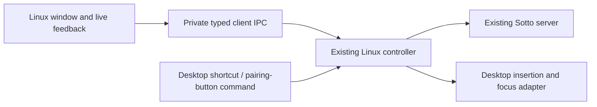

# Sotto Linux GUI design exploration

Ref #10. Published gallery: https://plans.kristofferr.com/d/fo12u4el8h2x

## Brief

Keep the Mac app recognizable, especially settings arrangement and live dictation feedback. The Linux app should look comfortable across distributions, not like an Omarchy theme. Eight visual directions are proposed for selection; no product UI direction or framework is finalized by this document.

The gallery contains 16 direction screens, six full reference screens, three overlay designs with eight states, six recovery states, and three setup screens. The window mockups support warm/light and dark appearances. The compact setup examples deliberately show warm light. Gallery controls provide a browser-local shortlist and filtering; the app controls themselves are static illustrations.

Recommendation: direction A with the H1 capsule. A preserves the sidebar order Dictation, History, Microphone, Server preferences, This computer. H1 stays close to the Mac feedback capsule. Use the explicit recovery copy shown in the gallery regardless of the chosen visual direction.

The palette and ribbon mark come from the existing Sotto sources, not from Omarchy. Window-control position is illustrative; native decorations and compositor capabilities are independent of product styling. No decorative continuous animation is proposed.

## Cotto assessment

Inspected [JessePomeroy/cotto](https://github.com/JessePomeroy/cotto) at commit `7b7dd80daf6e76cbc21b41cd3ddd623841409c0c`, read-only. No code from the fork was copied into this gallery or the product.

| Area | Observed implementation | Fit for Sotto |
| --- | --- | --- |
| UI | [Qt 6.8+, C++20 and QML](https://github.com/JessePomeroy/cotto/blob/7b7dd80daf6e76cbc21b41cd3ddd623841409c0c/Linux/CMakeLists.txt), with a [compact 340 × 380 settings menu](https://github.com/JessePomeroy/cotto/blob/7b7dd80daf6e76cbc21b41cd3ddd623841409c0c/Linux/qml/Main.qml) | Useful shell/reference. Its four-page compact menu does not preserve our five-page Mac layout or shared settings scope. |
| Shortcuts | [GlobalShortcuts portal lifecycle](https://github.com/JessePomeroy/cotto/blob/7b7dd80daf6e76cbc21b41cd3ddd623841409c0c/Linux/src/DesktopShortcuts.cpp), request/session checks and permission recovery | Study for a KDE adapter and portable capability detection. Do not infer every compositor supports it. |
| Paste | [RemoteDesktop portal plus clipboard and Ctrl+Shift+V](https://github.com/JessePomeroy/cotto/blob/7b7dd80daf6e76cbc21b41cd3ddd623841409c0c/Linux/src/DesktopPaste.cpp) | Useful permission/lifecycle patterns, but its dispatched paste is explicitly unconfirmed. Preserve our field-level guards and truthful result states. |
| Tray | [Qt tray controller](https://github.com/JessePomeroy/cotto/blob/7b7dd80daf6e76cbc21b41cd3ddd623841409c0c/Linux/src/TrayController.cpp), hide/reopen and quit handling | Useful reference. A tray must remain optional; closing the main window must not silently abandon active work. |
| Capture | Qt audio capture, PCM conversion and client uploads | Do not import as a second default capture path. Our existing server owns remote DJI and Linux microphone sessions. |
| Settings | Local dictionary and engine setup | Do not create a second settings universe. Our dictionary, provider preferences, retention and history live on the shared server. |
| Scope | [KDE/Wayland development software](https://github.com/JessePomeroy/cotto/blob/7b7dd80daf6e76cbc21b41cd3ddd623841409c0c/docs/linux/STATUS.md); other compositors and packaging not claimed complete | Useful starting evidence, not a substitute for platform integration. The fork removed its macOS app; Sotto must retain ours. |
| License | [MIT license](https://github.com/JessePomeroy/cotto/blob/7b7dd80daf6e76cbc21b41cd3ddd623841409c0c/LICENSE) and third-party notices | Preserve applicable copyright/license notices with any future copied code. |

## Proposed implementation boundary

Keep the Bun client/controller as the single owner of a Linux dictation and its text destination. Add the GUI as a presentation/control client, rather than running a second capture controller inside the window.

The existing IPC supplies CLI commands and strings. A GUI needs a small structured snapshot/event API for activity, source, destination, text, delivery outcome and errors, plus validated commands. It should not parse human-readable CLI status strings or create a general-purpose unauthenticated server proxy. Prefer extending existing ownership/lifetime rules over adding another service.

Qt/QML is the first framework candidate because it matches the useful Cotto work and supports custom Sotto styling without a browser shell. This is a candidate, not a completed framework selection. Before product implementation, resolve the bridge to the existing Bun controller, non-activating overlay behavior, packaging, accessibility and practical idle cost. GTK and a webview shell remain alternatives; no speculative framework rewrite is authorized by this design exploration.

Linux visual consistency and Linux desktop integration are separate tasks. Keep platform differences behind capability-driven adapters: global shortcuts, text insertion, session lock/sleep, tray, autostart and overlay placement. Preserve the existing Hyprland adapter initially; investigate portal-based adapters without embedding compositor-specific labels or assumptions throughout the interface.

## UI behavior to preserve

- Shortcut dictation uses the next eligible input from this computer's priority list. A recording pins its source; it never silently changes microphones mid-take.
- Pairing-button dictation uses the designated receiver and explicit destination ownership. A button request does not choose a distant fallback microphone.
- Show the selected input and text destination as separate facts. Unknown, unavailable and disconnected are not interchangeable; connected does not establish radio audio health.
- Preserve shared server history/settings versus local endpoint, device name, shortcut, priorities and desktop access. Do not make cloud/local model setup a second UI universe.
- The overlay never takes keyboard focus. Starting, recording, processing, inserted, ready-to-copy, uncertain and interrupted are distinct states.
- A completed transcript without insertion must be easy to retrieve. Never label an unconfirmed paste as inserted or automatically retry an uncertain delivery.
- Avoid platform-wide shortcuts, tray availability or built-in microphones as universal defaults. Show only actual capabilities/inputs.
- Theme, text scale, reduced motion and contrast should not require changing the desktop's global theme.

## Next work after a visual choice

1. Build the chosen window shell with Dictation and the familiar settings navigation, backed by representative state fixtures.
2. Extend private IPC with typed snapshots/events and validated GUI commands; keep the existing controller as the only session owner.
3. Add main-window state and a non-activating overlay. Keep transcript recovery visible before adding more desktop-specific styling.
4. Bring in history and shared settings through existing contracts, then local preferences and microphone priorities.
5. Add desktop capability reporting and packaging. Use targeted automated/UI checks; schedule physical tests only for a concrete unresolved integration.

The foundation is [PR #13](https://github.com/kristofferR/sottoniox/pull/13), stacked on #12, with autofix enabled. Design selection precedes product UI implementation; the working Mac app and server remain separate deployment targets.

## Rebuild and review

Run `bun docs/design/build-linux-gallery.mjs`. It writes the self-contained `linux-gui-gallery.html`. The file remains below the HTML communication 512 KB limit and has no external assets, forms, network requests or live product controls. Gallery interactions cover theme selection, shortlisting and filtering. Publish the same local path to preserve the gallery URL. Browser checks cover the rendered desktop layouts, light/dark switching, shortlist persistence, filtering and narrow-screen document overflow.
