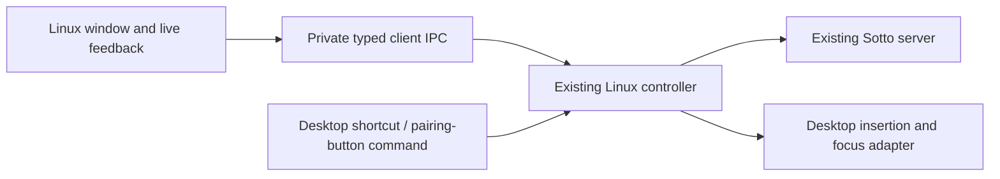

# Sotto Linux GUI design exploration

Ref #10. Published gallery: https://plans.kristofferr.com/d/fo12u4el8h2x

## Brief

Keep the Mac app recognizable, especially settings arrangement and live dictation feedback. The Linux app should look comfortable across distributions, not like an Omarchy theme. Eight visual directions were explored. Kris selected direction A on 2026-09-21. Implementation uses Qt/QML with the existing Bun controller.

The gallery contains 16 direction screens, six full reference screens, three overlay designs with eight states, six recovery states, and three setup screens. The window mockups support warm/light and dark appearances. The compact setup examples deliberately show warm light. Gallery controls provide a browser-local shortlist and filtering; the app controls themselves are static illustrations.

Approved: direction A. The H1 capsule remains the Mac-style live feedback direction. A preserves the sidebar order Dictation, History, Microphone, Server preferences, This computer. H1 stays close to the Mac feedback capsule. Use the explicit recovery copy shown in the gallery regardless of the chosen visual direction.

The palette and ribbon mark come from the existing Sotto sources, not from Omarchy. Window-control position is illustrative; native decorations and compositor capabilities are independent of product styling. No decorative continuous animation is proposed.

## Selected appearance behavior

Keep A’s layout for all themes. Offer Sotto warm light, Glacier dark, follow-system, and an optional Omarchy appearance. Kris explicitly selected following the active Omarchy palette. Read its colors without modifying desktop configuration; fall back to Glacier if the palette is missing or invalid.

## Cotto assessment

Inspected [JessePomeroy/cotto](https://github.com/JessePomeroy/cotto) at commit `7b7dd80daf6e76cbc21b41cd3ddd623841409c0c`, read-only. No code from the fork was copied into this gallery or the product.

| Area | Observed implementation | Fit for Sotto |
| --- | --- | --- |
| UI | [Qt 6.8+, C++20 and QML](https://github.com/JessePomeroy/cotto/blob/7b7dd80daf6e76cbc21b41cd3ddd623841409c0c/Linux/CMakeLists.txt), with a [compact 340 × 380 settings menu](https://github.com/JessePomeroy/cotto/blob/7b7dd80daf6e76cbc21b41cd3ddd623841409c0c/Linux/qml/Main.qml) | Useful shell/reference. Its four-page compact menu does not preserve our five-page Mac layout or shared settings scope. |
| Shortcuts | [GlobalShortcuts portal lifecycle](https://github.com/JessePomeroy/cotto/blob/7b7dd80daf6e76cbc21b41cd3ddd623841409c0c/Linux/src/DesktopShortcuts.cpp), request/session checks and permission recovery | Study for a KDE adapter and portable capability detection. Do not infer every compositor supports it. |
| Paste | [RemoteDesktop portal plus clipboard and Ctrl+Shift+V](https://github.com/JessePomeroy/cotto/blob/7b7dd80daf6e76cbc21b41cd3ddd623841409c0c/Linux/src/DesktopPaste.cpp) | Useful permission/lifecycle patterns, but its dispatched paste is explicitly unconfirmed. Preserve our field-level guards and truthful result states. |
| Tray | [Qt tray controller](https://github.com/JessePomeroy/cotto/blob/7b7dd80daf6e76cbc21b41cd3ddd623841409c0c/Linux/src/TrayController.cpp), hide/reopen and quit handling | Useful reference. A tray must remain optional; closing the main window must not silently abandon active work. |
| Capture | Qt audio capture, PCM conversion and client uploads | Do not import as a second default capture path. Our existing server owns remote DJI and Linux microphone sessions. |
| Settings | Local dictionary and engine setup | Do not create a second settings universe. Our dictionary, provider preferences, retention and history live on the shared server. |
| Scope | [KDE/Wayland development software](https://github.com/JessePomeroy/cotto/blob/7b7dd80daf6e76cbc21b41cd3ddd623841409c0c/docs/linux/STATUS.md); other compositors and packaging not claimed complete | Useful starting evidence, not a substitute for platform integration. The fork removed its macOS app; Sotto must retain ours. |
| License | [MIT license](https://github.com/JessePomeroy/cotto/blob/7b7dd80daf6e76cbc21b41cd3ddd623841409c0c/LICENSE) and third-party notices | Preserve applicable copyright/license notices with any future copied code. |

## Implementation boundary

Keep the Bun client/controller as the single owner of a Linux dictation and its text destination. Add the GUI as a presentation/control client, rather than running a second capture controller inside the window.

The CLI commands remain compatible. The GUI now uses versioned JSON requests and structured snapshots over the same private socket, with explicit controller phases and scoped commands. It does not parse human-readable CLI status or expose arbitrary server paths. Local snapshots are polled every 500 ms; server health and sources refresh every five seconds while the window is visible.

The first implementation uses Qt 6.8+ and QML with a small C++ socket/theme bridge. The Mac app and Bun capture architecture remain intact. Cotto informed the framework assessment, but no fork code was copied. The capsule uses LayerShellQt 6.6+ on Wayland: a non-interactive bottom-centred overlay, 80 logical pixels above the active screen’s bottom edge, without reserving space or joining the tiling layout. The settings window keeps its ordinary role. Portal adapters and overlays for compositors without layer-shell remain separate work.

Verified on Omarchy/Hyprland on 2026-09-22 with two synthetic show/hide cycles: `sotto-dictation` appeared only in overlay layer 3, at `(1100, 1286)` with size `360 × 74` on the `2560 × 1440` display. Keyboard focus and existing tile geometry stayed unchanged. The rebuilt main window remained tiled. The preview did not connect to the client or open a microphone.

Linux visual consistency and Linux desktop integration are separate tasks. Keep platform differences behind capability-driven adapters: global shortcuts, text insertion, session lock/sleep, tray, autostart and overlay placement. Preserve the existing Hyprland adapter initially; investigate portal-based adapters without embedding compositor-specific labels or assumptions throughout the interface.

## UI behavior to preserve

- Shortcut dictation uses the next eligible input from this computer's priority list. A recording pins its source; it never silently changes microphones mid-take.
- Pairing-button dictation uses the designated receiver and explicit destination ownership. A button request does not choose a distant fallback microphone.
- Show the selected input and text destination as separate facts. Unknown, unavailable and disconnected are not interchangeable; connected does not establish radio audio health.
- Preserve shared server history/settings versus local endpoint, device name, shortcut, priorities and desktop access. Do not make cloud/local model setup a second UI universe.
- The overlay never takes keyboard focus. Starting, recording, processing, inserted, ready-to-copy, uncertain and interrupted are distinct states.
- A completed transcript without insertion must be easy to retrieve. Never label an unconfirmed paste as inserted or automatically retry an uncertain delivery.
- Avoid platform-wide shortcuts, tray availability or built-in microphones as universal defaults. Show only actual capabilities/inputs.
- Theme, text scale, reduced motion and contrast should not require changing the desktop's global theme.

## First implementation and remaining work

All five pages are implemented in `LinuxClient/gui`, including real shared history/preferences, local source priorities, pairing-button destination selection, transcript recovery and a passive capsule. A dedicated microphone-test path cannot insert text or select a destination. See [the GUI README](../../LinuxClient/gui/README.md) for build/run commands, automated checks and exact scope.

Next work: initial setup and shortcut/autostart editing, named microphone profiles, full dictionary-list editing, audio playback, unsaved-edit recovery, packaging and portal-based desktop adapters. Physical tests are reserved for concrete unresolved compositor/device behavior.

The foundation is [PR #13](https://github.com/kristofferR/sottoniox/pull/13), stacked on #12, with autofix enabled. Direction A is now selected; the working Mac app and server remain separate deployment targets.

## Rebuild and review

Run `bun docs/design/build-linux-gallery.mjs`. It writes the self-contained `linux-gui-gallery.html`. The file remains below the HTML communication 512 KB limit and has no external assets, forms, network requests or live product controls. Gallery interactions cover theme selection, shortlisting and filtering. Publish the same local path to preserve the gallery URL. Browser checks cover the rendered desktop layouts, light/dark switching, shortlist persistence, filtering and narrow-screen document overflow.
